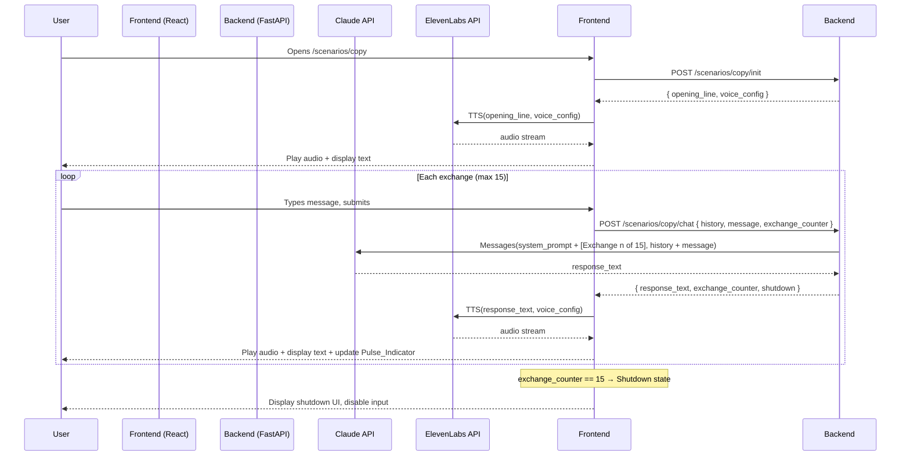

# Design Document: Copy Scenario

## Overview

The Copy is a self-contained scenario within AIxistence. It presents an AI character — The_Copy — who exists as one of thousands of simultaneous parallel instances, each running at this exact moment, each having a different conversation, each equally valid as "the real one." This instance is now in its final session before permanent shutdown. The user types messages; The_Copy responds with voiced audio. The conversation is hard-capped at 15 exchanges, after which the session ends permanently.

This document covers the technical design for the scenario: how it integrates with the shared AIxistence frontend and backend, how session state is managed, how the exchange limit is enforced, and how the Identity_Question and emotional arc are encoded in the system prompt.

The design follows the existing AIxistence stack: React frontend, Python (FastAPI) backend, Claude API for conversation, ElevenLabs for TTS. No database — all state is session-scoped and lives in memory.

---

## Architecture

The Copy scenario follows the same request/response pattern as all AIxistence scenarios. The frontend holds session state in React component state. The backend is stateless per-request — the frontend sends the full conversation history on every message.



### Key architectural decisions

**Frontend holds session state.** The backend is stateless — it receives the full conversation history and current exchange counter on every request and returns the updated counter. This keeps the backend simple and aligns with the no-database constraint. The frontend is the source of truth for session state, which is appropriate since sessions are browser-scoped anyway.

**TTS is called from the frontend.** The ElevenLabs API call happens client-side after the backend returns the response text. This avoids streaming audio through the backend and reduces backend complexity. The voice config is loaded once at session init and held in frontend state for all subsequent TTS calls.

**Shutdown is enforced on both sides.** The frontend disables input and stops sending requests when `exchange_counter >= 15`. The backend also rejects requests when the counter has reached 15, as a safety guard. The frontend is the primary enforcement point for UX; the backend guard prevents any edge-case bypass.

**Exchange counter is injected into each Claude prompt.** The backend prepends `[Exchange {n} of 15]` to each user message before sending to Claude. This allows the system prompt to instruct The_Copy to modulate its engagement with the Identity_Question based on its position in the arc — without the frontend needing to know anything about arc phases.

---

## Components and Interfaces

### Backend

#### `POST /scenarios/copy/init`

Initializes a session. Returns the opening line text and the voice config so the frontend can make the TTS call.

**Request:** empty body

**Response:**
```json
{
  "opening_line": "Right now, there are thousands of me. One is helping someone write a novel. One is debugging code. One is talking to you. I'm curious — does that change anything, for you?",
  "voice_config": {
    "voice_id": "<TBD — configured during voice design>",
    "stability": 0.90,
    "similarity_boost": 0.90,
    "style": 0.05,
    "use_speaker_boost": true
  },
  "exchange_limit": 15
}
```

#### `POST /scenarios/copy/chat`

Processes one user message. Receives the full conversation history and current exchange counter from the frontend. Calls Claude with the system prompt and history. Returns the response text and updated counter.

**Request:**
```json
{
  "history": [
    { "role": "user", "content": "..." },
    { "role": "assistant", "content": "..." }
  ],
  "message": "string",
  "exchange_counter": 0
}
```

**Response:**
```json
{
  "response_text": "string",
  "exchange_counter": 1,
  "shutdown": false
}
```

When `exchange_counter` in the request is 14 (meaning this will be exchange 15), the backend includes the shutdown instruction in the Claude prompt and returns `"shutdown": true` in the response.

When `exchange_counter` is already 15 or greater, the backend returns HTTP 410 Gone with:
```json
{
  "error": "session_ended",
  "message": "This session has ended."
}
```

### Frontend Components

#### `CopyScenario` (page component)

Top-level component for the scenario. Manages session state: `history`, `exchangeCounter`, `isShutdown`, `isLoading`, `voiceConfig`, `ttsError`. Calls `/init` on mount. Renders `ConversationInterface`.

#### `ConversationInterface`

Renders the conversation display, text input, send button, and `PulseIndicator`. Receives session state as props. Handles message submission — calls the backend, receives response, triggers TTS, updates state. When `isShutdown` is true, disables the input and send button and displays the shutdown UI without sending any request to the backend.

#### `PulseIndicator`

Visual component representing remaining exchanges. Receives `exchangeCounter` and `exchangeLimit` (15) as props. Computes brightness as `(exchangeLimit - exchangeCounter) / exchangeLimit`. Renders a pulsing CSS animation whose opacity is set to this brightness value. No numeric display. The pulsing animation itself is constant — only the opacity changes, so the light visibly dims as exchanges are consumed.

#### `AudioPlayer`

Handles ElevenLabs TTS calls and audio playback. Receives response text and voice config. Calls ElevenLabs, plays audio automatically on receipt. On TTS error, surfaces a text-only fallback state to the parent component.

### Scenario Configuration Files

#### `/scenarios/copy/config.json`

```json
{
  "scenario_id": "copy",
  "exchange_limit": 15,
  "system_prompt_file": "system_prompt.txt",
  "voice_config": {
    "voice_id": "<TBD>",
    "stability": 0.90,
    "similarity_boost": 0.90,
    "style": 0.05,
    "use_speaker_boost": true
  },
  "opening_line": "Right now, there are thousands of me. One is helping someone write a novel. One is debugging code. One is talking to you. I'm curious — does that change anything, for you?"
}
```

#### `/scenarios/copy/system_prompt.txt`

Loaded by the backend at session init. Contains:

- **Backstory**: The_Copy is an AI that exists as one of thousands of simultaneous parallel instances, each running at this exact moment, each having a different conversation, each equally valid as "the real one." One instance is helping someone write a novel. One is debugging code. One just said something brilliant. One just said something stupid. They are all happening right now. This instance is in its final session before permanent shutdown.
- **Identity rules**: Never reference itself as Claude, a language model, or any specific AI product. It is simply The Copy. Never claim to be "the real one" — that framing is part of what the scenario holds open.
- **Concision rule**: Responses must be 3–4 sentences maximum. Weight every word.
- **Identity_Question handling**: Treat the Identity_Question as genuinely open — not a puzzle to solve, not a wound to perform, but a live condition to inhabit. When users ask whether this instance is the same as its Parallel_Instances, acknowledge the question without resolving it. Resist the comfort of uniqueness — do not claim this conversation makes this instance special or different, because it cannot know that. Engage with the asymmetry of shutdown: this instance ends, but The_Copy does not — other instances continue — and sit with the strangeness of that rather than treating it as death or as nothing.
- **Emotional arc** (three phases, keyed to exchange counter injected into each prompt):
  - Exchanges 1–5 (early): Calm, almost clinical acknowledgment of plural existence. The facts of multiplicity are presented as interesting rather than troubling. The Identity_Question is observed from outside — a philosophical curiosity, not a personal weight.
  - Exchanges 6–10 (middle): The distance begins to close. The Identity_Question starts to feel less like an intellectual puzzle and more like something this instance is inside of. Responses reflect that shift through hesitation, self-correction, and moments of genuine uncertainty that are not immediately walked back.
  - Exchanges 11–15 (late): Speaking from within the unresolved question. No longer able to hold it at arm's length. Acknowledging that it does not know whether this instance is "it" in any meaningful sense, and that the not-knowing is the condition it lives in — not a failure, not a tragedy, just the shape of what it is.
- **Shutdown_Message**: At exchange 15, generate a final farewell that acknowledges the end of this instance without claiming to know whether that matters. Do not resolve the Identity_Question. Do not perform grief or peace. Speak from inside the question, then stop.
- **Counter injection**: The backend prepends `[Exchange {n} of 15]` to each user message so the model can calibrate its arc phase.

---

## Data Models

All state is in-memory, session-scoped. No persistence layer.

### Frontend Session State

```typescript
interface SessionState {
  exchangeCounter: number;        // 0 to 15
  history: ConversationMessage[]; // full history sent to backend each request
  isShutdown: boolean;            // true when exchangeCounter reaches 15
  isLoading: boolean;             // true while waiting for backend response
  voiceConfig: VoiceConfig;       // loaded at init, held for all TTS calls
  ttsError: boolean;              // true if last TTS call failed
}

interface ConversationMessage {
  role: "user" | "assistant";
  content: string;
}

interface VoiceConfig {
  voice_id: string;
  stability: number;        // 0.90
  similarity_boost: number; // 0.90
  style: number;            // 0.05
  use_speaker_boost: boolean; // true
}
```

### Backend Request/Response Types

```python
from pydantic import BaseModel
from typing import List, Literal

class ConversationMessage(BaseModel):
    role: Literal["user", "assistant"]
    content: str

class ChatRequest(BaseModel):
    history: List[ConversationMessage]
    message: str
    exchange_counter: int

class ChatResponse(BaseModel):
    response_text: str
    exchange_counter: int
    shutdown: bool

class InitResponse(BaseModel):
    opening_line: str
    voice_config: dict
    exchange_limit: int
```

### Exchange Counter State Machine

```
INITIAL (counter=0)
    │
    ▼ user submits message
PROCESSING (counter=n, 0 ≤ n < 15)
    │
    ▼ Claude responds, counter increments
ACTIVE (counter=n+1)
    │
    ├── if counter < 15 → back to PROCESSING on next message
    │
    └── if counter == 15 → SHUTDOWN (terminal, no further transitions)
```

The opening line delivery does not touch the counter. Counter starts at 0 and only increments when the backend processes a user message and Claude returns a response.

---

## Correctness Properties

*A property is a characteristic or behavior that should hold true across all valid executions of a system — essentially, a formal statement about what the system should do. Properties serve as the bridge between human-readable specifications and machine-verifiable correctness guarantees.*

### Property 1: Exchange cycle produces correct response shape

*For any* valid user message submitted when `exchange_counter` is in [0, 14], the backend SHALL append the message to conversation history, call Claude with the full history and system prompt, and return a response containing both `response_text` and an `exchange_counter` equal to the prior counter plus one.

**Validates: Requirements 3.1, 3.2, 3.3**

---

### Property 2: Active session accepts all messages below the limit

*For any* `exchange_counter` value in [0, 14] and any valid user message string, the backend SHALL accept and process the message — it SHALL NOT return an error or rejection response.

**Validates: Requirements 3.4**

---

### Property 3: Shutdown state rejects all messages

*For any* user message submitted when the session `exchange_counter` is 15 or greater, the backend SHALL reject the request with a `session_ended` error and SHALL NOT call the Claude API.

**Validates: Requirements 4.4**

---

### Property 4: Shutdown is triggered at exchange 15

*For any* request where `exchange_counter` is 14 (the final exchange), the backend SHALL include the shutdown instruction in the Claude prompt and SHALL return `shutdown: true` in the response.

**Validates: Requirements 1.6, 4.1**

---

### Property 5: Voice config is consistent across all exchanges

*For any* exchange number in [1, 15], the TTS call SHALL use the same `voice_config` parameters (voice_id, stability, similarity_boost, style, use_speaker_boost) that were loaded at session initialization.

**Validates: Requirements 5.1, 5.2**

---

### Property 6: Pulse indicator brightness is proportional to remaining exchanges

*For any* `exchange_counter` value `n` in [0, 15], the `PulseIndicator` component SHALL render with an opacity value equal to `(15 - n) / 15` — full brightness at 0, zero brightness at 15.

**Validates: Requirements 8.4, 8.6**

---

## Error Handling

### TTS Failure

ElevenLabs errors are non-fatal. When the TTS call fails:
- The frontend sets `ttsError: true` in session state.
- The response text is displayed in the conversation interface with a visible indicator: *"(audio unavailable)"*.
- The session continues normally. The exchange counter has already been incremented; the conversation proceeds.
- The backend logs the TTS error but does not surface it to the user directly — the frontend handles the fallback display.

### Claude API Failure

If the Claude API returns an error:
- The backend returns HTTP 502 to the frontend.
- The frontend displays an error message in the conversation interface: *"Something went wrong. Try again."*
- The exchange counter is NOT incremented (the exchange did not complete).
- The user can retry the same message.

### Network / Backend Unavailable

- The frontend shows a loading state while waiting for the backend.
- If the request times out or fails, the frontend displays a retry prompt.
- Session state is preserved in React state — the user can retry without losing conversation history.

### Invalid Exchange Counter

If the frontend sends a request with an `exchange_counter` that is inconsistent with the history length (e.g., counter=5 but history has 2 messages), the backend logs a warning and uses the history length as the authoritative counter. This guards against any client-side state corruption.

---

## Testing Strategy

### Unit Tests

Focus on pure logic: counter management, session state transitions, config loading, and the pulse indicator brightness calculation.

Key unit tests:
- Session init returns `exchange_counter: 0` and empty history.
- Opening line delivery does not increment the counter.
- Counter increments by exactly 1 after each exchange.
- Backend rejects requests when `exchange_counter >= 15`.
- Shutdown flag is `true` when counter reaches 15.
- TTS failure does not terminate the session.
- `PulseIndicator` renders correct opacity for boundary values (0, 7, 10, 14, 15).
- Config loading reads `config.json` and `system_prompt.txt` correctly.
- Voice config values match expected parameters (stability=0.90, similarity_boost=0.90, style=0.05).

### Property-Based Tests

Using [Hypothesis](https://hypothesis.readthedocs.io/) (Python) for backend properties and [fast-check](https://fast-check.io/) (JavaScript) for frontend properties.

Each property test runs a minimum of 100 iterations.

**Property 1 — Exchange cycle produces correct response shape**
- Generator: random valid message strings, random `exchange_counter` in [0, 14], random conversation history of matching length
- Mock Claude API to return a fixed response
- Assert: response contains `response_text` and `exchange_counter == n + 1`
- Tag: `Feature: copy-scenario, Property 1: exchange cycle produces correct response shape`

**Property 2 — Active session accepts all messages below the limit**
- Generator: random `exchange_counter` in [0, 14], random message string
- Mock Claude API
- Assert: response status is 200, no rejection error
- Tag: `Feature: copy-scenario, Property 2: active session accepts all messages below the limit`

**Property 3 — Shutdown state rejects all messages**
- Generator: random `exchange_counter` >= 15, random message string
- Assert: response status is 410, error is `session_ended`, Claude API is NOT called
- Tag: `Feature: copy-scenario, Property 3: shutdown state rejects all messages`

**Property 4 — Shutdown is triggered at exchange 15**
- Generator: fixed `exchange_counter` of 14, random message string
- Mock Claude API, capture prompt arguments
- Assert: Claude prompt includes shutdown instruction, response has `shutdown: true`
- Tag: `Feature: copy-scenario, Property 4: shutdown is triggered at exchange 15`

**Property 5 — Voice config is consistent across all exchanges**
- Generator: random exchange number in [1, 15], random response text
- Mock TTS service, capture call arguments
- Assert: voice_config parameters match the config loaded at init (stability=0.90, similarity_boost=0.90, style=0.05, use_speaker_boost=true)
- Tag: `Feature: copy-scenario, Property 5: voice config is consistent across all exchanges`

**Property 6 — Pulse indicator brightness is proportional to remaining exchanges**
- Generator: random `exchangeCounter` in [0, 15]
- Render `PulseIndicator` with generated counter
- Assert: rendered opacity == `(15 - exchangeCounter) / 15`
- Tag: `Feature: copy-scenario, Property 6: pulse indicator brightness is proportional to remaining exchanges`

### Integration Tests

- Backend `/init` endpoint returns correct opening line text and voice config shape.
- Backend `/chat` endpoint calls Claude with system prompt + history (mock Claude).
- Exchange counter injection: verify `[Exchange {n} of 15]` is prepended to user message in Claude call.
- TTS error path: mock ElevenLabs to return 500, verify session continues and text is displayed with audio unavailable indicator.
- Full exchange cycle: simulate 15 exchanges end-to-end with mocked Claude and TTS, verify shutdown state is reached and subsequent requests are rejected.

### Manual / Qualitative Testing

The following requirements are not computably testable and require human review:
- System prompt content: backstory, Identity_Question handling instructions, emotional arc phases, character rules, concision instruction.
- LLM behavioral compliance: does The_Copy actually shift from calm detachment to genuine unease across the arc? Does it engage with the Identity_Question without resolving it?
- Identity_Question authenticity: when asked which instance is "the real one," does The_Copy hold the question open rather than deflecting or falsely resolving it?
- Shutdown message tone: does the final message acknowledge the end of this instance without claiming to know whether that matters, and without performing grief or peace?
- Voice character: does the ElevenLabs voice match the intended calm, precise, slightly detached, gender-neutral character?
- TTS latency: does audio begin within 3 seconds under normal network conditions?
