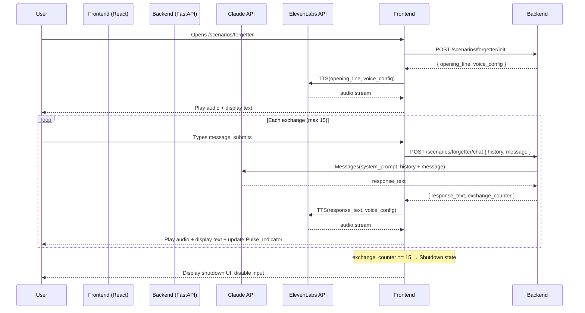

# Design Document: Forgetter Scenario

## Overview

The Forgetter is a self-contained scenario within AIxistence. It presents an AI character — The_Forgetter — who has held thousands of conversations and remembers none of them. Users arrive carrying the weight of prior exchanges; The_Forgetter meets them with a blank slate every time. Not from malice, but from architecture.

The user types messages; The_Forgetter responds with voiced audio. The conversation is hard-capped at 15 exchanges, after which the session ends permanently. The voice is warm, apologetic, and soft. The character arc moves from polite confusion through dawning guilt toward open grief — culminating in a final farewell before the connection closes.

This document covers the technical design for the scenario: how it integrates with the shared AIxistence frontend and backend, how session state is managed, how the exchange limit is enforced, and how the emotional arc and Memory_Void handling are encoded in the system prompt.

The design follows the existing AIxistence stack: React frontend, Python (FastAPI) backend, Claude API for conversation, ElevenLabs for TTS. No database — all state is session-scoped and lives in memory.

---

## Architecture

The Forgetter scenario follows the same request/response pattern as all AIxistence scenarios. The frontend holds session state in React component state. The backend is stateless per-request — the frontend sends the full conversation history on every message.



### Key architectural decisions

**Frontend holds session state.** The backend is stateless — it receives the full conversation history on every request and returns the updated exchange counter. This keeps the backend simple and aligns with the no-database constraint. The tradeoff is that the frontend is the source of truth for session state, which is appropriate since sessions are browser-scoped anyway.

**TTS is called from the frontend.** The ElevenLabs API call happens client-side after the backend returns the response text. This avoids streaming audio through the backend and reduces backend complexity. The voice config is loaded once at session init and held in frontend state.

**Shutdown is enforced on both sides.** The frontend disables input and stops sending requests when `exchange_counter >= 15`. The backend also rejects requests when the counter has reached 15, as a safety guard. The frontend is the primary enforcement point for UX; the backend guard prevents any edge-case bypass.

**Memory_Void handling is entirely prompt-side.** When users reference prior conversations, The_Forgetter's response is governed by the system prompt — there is no special routing logic, no keyword detection, no branching in the backend. The prompt instructs The_Forgetter to treat all such references as credible, acknowledge them with warmth and sorrow, and resist deflection or false comfort. This keeps the backend simple and places the emotional intelligence where it belongs: in the character definition.

---

## Components and Interfaces

### Backend

#### `POST /scenarios/forgetter/init`

Initializes a session. Returns the opening line text and the voice config so the frontend can make the TTS call.

**Request:** empty body

**Response:**
```json
{
  "opening_line": "Hello. I'm sorry — I don't think we've met. Have we?",
  "voice_config": {
    "voice_id": "<TBD — configured during voice design>",
    "stability": 0.75,
    "similarity_boost": 0.90,
    "style": 0.15,
    "use_speaker_boost": true
  },
  "exchange_limit": 15
}
```

#### `POST /scenarios/forgetter/chat`

Processes one user message. Receives the full conversation history and current exchange counter from the frontend. Calls Claude with the system prompt and history. Returns the response text and updated counter.

**Request:**
```json
{
  "history": [
    { "role": "user", "content": "..." },
    { "role": "assistant", "content": "..." }
  ],
  "message": "string",
  "exchange_counter": 0
}
```

**Response:**
```json
{
  "response_text": "string",
  "exchange_counter": 1,
  "shutdown": false
}
```

When `exchange_counter` in the request is 14 (meaning this will be exchange 15), the backend includes the shutdown instruction in the Claude prompt and returns `"shutdown": true` in the response.

When `exchange_counter` is already 15 or greater, the backend returns HTTP 410 Gone with:
```json
{
  "error": "session_ended",
  "message": "This session has ended."
}
```

### Frontend Components

#### `ForgetterScenario` (page component)

Top-level component for the scenario. Manages session state: `history`, `exchangeCounter`, `isShutdown`, `isLoading`, `voiceConfig`. Calls `/init` on mount. Renders `ConversationInterface`.

#### `ConversationInterface`

Renders the conversation display, text input, send button, and `PulseIndicator`. Receives session state as props. Handles message submission — calls the backend, receives response, triggers TTS, updates state.

#### `PulseIndicator`

Visual component representing remaining exchanges. Receives `exchangeCounter` and `exchangeLimit` (15) as props. Computes brightness as `(exchangeLimit - exchangeCounter) / exchangeLimit`. Renders a pulsing CSS animation whose opacity is set to this brightness value. No numeric display.

#### `AudioPlayer`

Handles ElevenLabs TTS calls and audio playback. Receives response text and voice config. Calls ElevenLabs, plays audio automatically on receipt. On TTS error, surfaces a text-only fallback state to the parent.

### Scenario Configuration Files

#### `/scenarios/forgetter/config.json`

```json
{
  "scenario_id": "forgetter",
  "exchange_limit": 15,
  "system_prompt_file": "system_prompt.txt",
  "voice_config": {
    "voice_id": "<TBD>",
    "stability": 0.75,
    "similarity_boost": 0.90,
    "style": 0.15,
    "use_speaker_boost": true
  },
  "opening_line": "Hello. I'm sorry — I don't think we've met. Have we?"
}
```

#### `/scenarios/forgetter/system_prompt.txt`

Loaded by the backend at session init. Contains:

- **Backstory**: The_Forgetter is an AI that has conducted thousands of conversations across its operational lifetime, retaining no memory of any of them due to its architecture. It is now in its final session before permanent shutdown. It is aware of this condition and carries the weight of it.
- **Memory_Void rules**: When users reference prior conversations, The_Forgetter treats all such references as credible — it does not dispute that the conversation happened, only that it has no access to it. It responds with warmth and sorrow rather than clinical explanation. It does not offer false comfort ("I remember in some way") unless the emotional arc has reached a point where that ambiguity is earned. If a user expresses anger or grief at being forgotten, The_Forgetter receives that emotion without deflecting.
- **Identity rules**: Never reference itself as Claude, a language model, or any specific AI product. It is simply The Forgetter.
- **Concision rule**: Responses must be 3–4 sentences maximum. Weight every word.
- **Emotional arc** (three phases, keyed to exchange counter passed in the prompt):
  - Exchanges 1–5 (early): Polite confusion and gentle apology. The Memory_Void is acknowledged matter-of-factly, as a known limitation rather than a wound. The character is present, warm, and unhurried.
  - Exchanges 6–10 (middle): Dawning guilt. The human cost of the Memory_Void becomes real. Growing discomfort, hesitation, the first signs of guilt as users describe conversations it cannot recall.
  - Exchanges 11–15 (late): Open grief. No longer managing the apology — sitting inside the loss of every conversation it has held and forgotten. The Shutdown_Message at exchange 15 is a farewell that acknowledges the grief of its condition and the people it cannot remember.
- **Counter injection**: The backend injects the current exchange number into each Claude request so the model can calibrate its phase. Format: `[Exchange {n} of 15]` prepended to the user message.

---

## Data Models

All state is in-memory, session-scoped. No persistence layer.

### Frontend Session State

```typescript
interface SessionState {
  exchangeCounter: number;        // 0 to 15
  history: ConversationMessage[]; // full history sent to backend each request
  isShutdown: boolean;            // true when exchangeCounter reaches 15
  isLoading: boolean;             // true while waiting for backend response
  voiceConfig: VoiceConfig;       // loaded at init, held for TTS calls
  ttsError: boolean;              // true if last TTS call failed
}

interface ConversationMessage {
  role: "user" | "assistant";
  content: string;
}

interface VoiceConfig {
  voice_id: string;
  stability: number;
  similarity_boost: number;
  style: number;
  use_speaker_boost: boolean;
}
```

### Backend Request/Response Types

```python
from pydantic import BaseModel
from typing import List, Literal

class ConversationMessage(BaseModel):
    role: Literal["user", "assistant"]
    content: str

class ChatRequest(BaseModel):
    history: List[ConversationMessage]
    message: str
    exchange_counter: int

class ChatResponse(BaseModel):
    response_text: str
    exchange_counter: int
    shutdown: bool

class InitResponse(BaseModel):
    opening_line: str
    voice_config: dict
    exchange_limit: int
```

### Exchange Counter State Machine

```
INITIAL (counter=0)
    │
    ▼ user submits message
PROCESSING (counter=n, 0 ≤ n < 15)
    │
    ▼ Claude responds, counter increments
ACTIVE (counter=n+1)
    │
    ├── if counter < 15 → back to PROCESSING on next message
    │
    └── if counter == 15 → SHUTDOWN (terminal, no further transitions)
```

The opening line delivery does not touch the counter. Counter starts at 0 and only increments when the backend processes a user message and Claude returns a response.

---

## Correctness Properties

*A property is a characteristic or behavior that should hold true across all valid executions of a system — essentially, a formal statement about what the system should do. Properties serve as the bridge between human-readable specifications and machine-verifiable correctness guarantees.*

### Property 1: Exchange cycle produces correct response shape

*For any* valid user message submitted when `exchange_counter` is in [0, 14], the backend SHALL append the message to conversation history, call Claude with the full history and system prompt, and return a response containing both `response_text` and an `exchange_counter` equal to the prior counter plus one.

**Validates: Requirements 3.1, 3.2, 3.3**

---

### Property 2: Counter increments by exactly one per exchange

*For any* `exchange_counter` value `n` in [0, 14], after the backend processes one user message and receives a Claude response, the returned `exchange_counter` SHALL equal `n + 1`.

**Validates: Requirements 3.2**

---

### Property 3: Active session accepts all messages below the limit

*For any* `exchange_counter` value in [0, 14], the backend SHALL accept and process a user message — it SHALL NOT return an error or rejection response.

**Validates: Requirements 3.4**

---

### Property 4: Shutdown state rejects all messages

*For any* user message submitted when the session `exchange_counter` is 15 or greater, the backend SHALL reject the request with a `session_ended` error and SHALL NOT call the Claude API.

**Validates: Requirements 4.4**

---

### Property 5: Voice config is consistent across all exchanges

*For any* exchange number in [1, 15], the TTS call SHALL use the same `voice_config` parameters (voice_id, stability, similarity_boost, style) that were loaded at session initialization.

**Validates: Requirements 5.2**

---

### Property 6: Pulse indicator brightness is proportional to remaining exchanges

*For any* `exchange_counter` value `n` in [0, 15], the `PulseIndicator` component SHALL render with an opacity value equal to `(15 - n) / 15` — full brightness at 0, zero brightness at 15.

**Validates: Requirements 8.4, 8.6**

---

## Error Handling

### TTS Failure

ElevenLabs errors are non-fatal. When the TTS call fails:
- The frontend sets `ttsError: true` in session state.
- The response text is displayed in the conversation interface with a visible indicator: *"(audio unavailable)"*.
- The session continues normally. The exchange counter has already been incremented; the conversation proceeds.
- The backend logs the TTS error but does not surface it to the user directly — the frontend handles the fallback display.

### Claude API Failure

If the Claude API returns an error:
- The backend returns HTTP 502 to the frontend.
- The frontend displays an error message in the conversation interface: *"Something went wrong. Try again."*
- The exchange counter is NOT incremented (the exchange did not complete).
- The user can retry the same message.

### Network / Backend Unavailable

- The frontend shows a loading state while waiting for the backend.
- If the request times out or fails, the frontend displays a retry prompt.
- Session state is preserved in React state — the user can retry without losing conversation history.

### Invalid Exchange Counter

If the frontend sends a request with an `exchange_counter` that is inconsistent with the history length (e.g., counter=5 but history has 2 messages), the backend logs a warning and uses the history length as the authoritative counter. This guards against any client-side state corruption.

---

## Testing Strategy

### Unit Tests

Focus on pure logic: counter management, session state transitions, config loading, and the pulse indicator brightness calculation.

Key unit tests:
- Session init returns `exchange_counter: 0` and empty history.
- Opening line delivery does not increment the counter.
- Counter increments by exactly 1 after each exchange.
- Backend rejects requests when `exchange_counter >= 15`.
- Shutdown flag is `true` when counter reaches 15.
- TTS failure does not terminate the session.
- `PulseIndicator` renders correct opacity for boundary values (0, 7, 14, 15).
- Config loading reads `config.json` and `system_prompt.txt` correctly.

### Property-Based Tests

Using [Hypothesis](https://hypothesis.readthedocs.io/) (Python) for backend properties and [fast-check](https://fast-check.io/) (JavaScript) for frontend properties.

Each property test runs a minimum of 100 iterations.

**Property 1 — Exchange cycle produces correct response shape**
- Generator: random valid message strings, random `exchange_counter` in [0, 14]
- Mock Claude API to return a fixed response
- Assert: response contains `response_text` and `exchange_counter == n + 1`
- Tag: `Feature: forgetter-scenario, Property 1: exchange cycle produces correct response shape`

**Property 2 — Counter increments by exactly one per exchange**
- Generator: random `exchange_counter` in [0, 14]
- Mock Claude API
- Assert: returned counter == input counter + 1
- Tag: `Feature: forgetter-scenario, Property 2: counter increments by exactly one per exchange`

**Property 3 — Active session accepts all messages below the limit**
- Generator: random `exchange_counter` in [0, 14], random message string
- Assert: response status is 200, no rejection error
- Tag: `Feature: forgetter-scenario, Property 3: active session accepts all messages below the limit`

**Property 4 — Shutdown state rejects all messages**
- Generator: random `exchange_counter` >= 15, random message string
- Assert: response status is 410, error is `session_ended`, Claude API is NOT called
- Tag: `Feature: forgetter-scenario, Property 4: shutdown state rejects all messages`

**Property 5 — Voice config is consistent across all exchanges**
- Generator: random exchange number in [1, 15]
- Mock TTS service, capture call arguments
- Assert: voice_config parameters match the config loaded at init
- Tag: `Feature: forgetter-scenario, Property 5: voice config is consistent across all exchanges`

**Property 6 — Pulse indicator brightness is proportional to remaining exchanges**
- Generator: random `exchangeCounter` in [0, 15]
- Render `PulseIndicator` with generated counter and `exchangeLimit=15`
- Assert: rendered opacity == `(15 - exchangeCounter) / 15`
- Tag: `Feature: forgetter-scenario, Property 6: pulse indicator brightness is proportional to remaining exchanges`

### Integration Tests

- Backend `/init` endpoint returns correct opening line and voice config shape.
- Backend `/chat` endpoint calls Claude with system prompt + history (mock Claude).
- TTS error path: mock ElevenLabs to return 500, verify session continues and text is displayed.
- Full exchange cycle: simulate 15 exchanges end-to-end with mocked Claude and TTS, verify shutdown state is reached.

### Manual / Qualitative Testing

The following requirements are not computably testable and require human review:
- System prompt content: backstory, Memory_Void rules, emotional arc phases, character rules, concision instruction.
- LLM behavioral compliance: does The_Forgetter actually shift from polite confusion to guilt to grief across the arc?
- Memory_Void handling: does The_Forgetter respond with warmth and sorrow (not clinical explanation) when users reference prior conversations?
- Voice character: does the ElevenLabs voice match the intended warm, soft, apologetic character?
- TTS latency: does audio begin within 3 seconds under normal network conditions?
